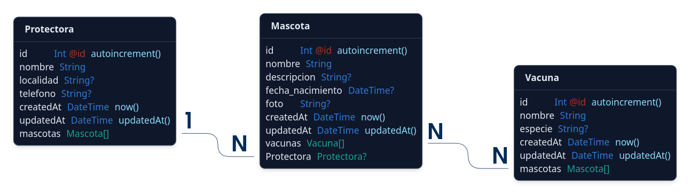

# Aplicación NextJS

Aplicación web para gestionar un grupo de Protectoras de Animales.

Realiza las operaciones CRUD usando el ORM Prisma.

En el esquema se declaran 3 modelos:

- Protectora
- Mascota
- Vacuna

El diagrama ER es el siguiente:

La aplicación está disponible como versión [demo en Vercel](https://nxprisma-crud-protectoras.vercel.app), y también es instalable.

